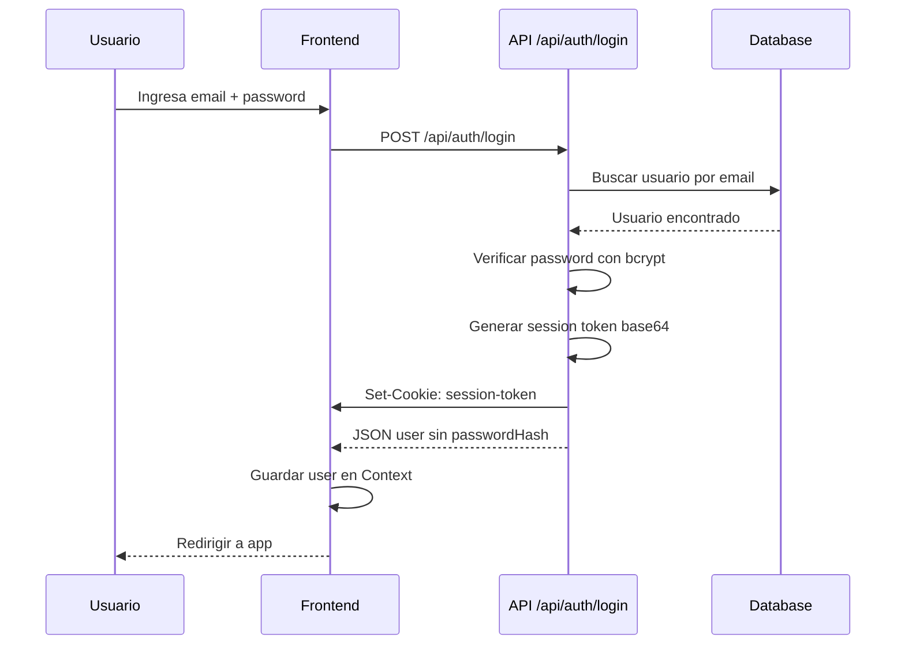
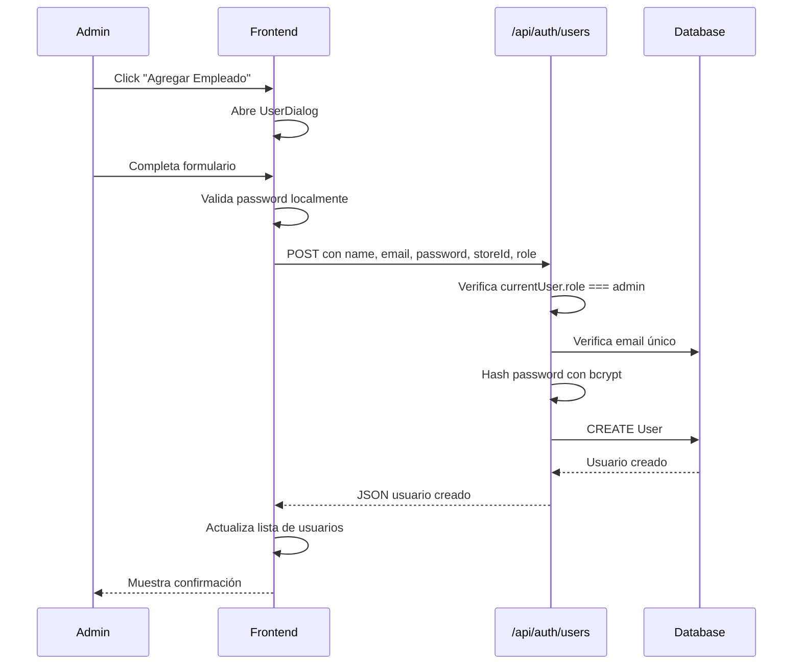

# SYSTEM_CONTEXT.md - VendePro POS System

> Documento de contexto base para futuros prompts de IA. Última actualización: 2026-03-31

---

## 1. Descripción General del Sistema

### Propósito
**VendePro** es un sistema de punto de venta (POS) para gestión de stock y ventas en tiendas minoristas. Permite procesar ventas con código de barras, gestionar inventario, visualizar reportes y administrar usuarios.

### Tipo de Usuarios
| Rol | Descripción | Permisos |
|-----|-------------|----------|
| `admin` | Administrador | Acceso completo: POS, Stock, Reportes, Usuarios |
| `employee` | Empleado/Vendedor | Acceso limitado: POS y Stock únicamente |

### Flujo Principal
1. **Login** → Usuario se autentica con email/contraseña
2. **POS (Caja)** → Escaneo de productos, carrito, cobro
3. **Stock** → Gestión de productos y categorías
4. **Reportes** → Dashboard de ventas (solo admin)
5. **Usuarios** → CRUD de usuarios (solo admin)

---

## 2. Roles y Permisos (RBAC)

### Roles Existentes
```typescript
type UserRole = "admin" | "employee"
```

### Matriz de Permisos
| Acción | admin | employee |
|--------|-------|----------|
| Ver POS/Caja | ✅ | ✅ |
| Gestionar Stock | ✅ | ✅ |
| Ver Reportes | ✅ | ❌ |
| Gestionar Usuarios | ✅ | ❌ |
| Crear usuarios | ✅ | ❌ |
| Editar usuarios | ✅ | ❌ |
| Eliminar usuarios | ✅ | ❌ |

### Restricciones Importantes
- **Auto-eliminación bloqueada**: Un admin no puede eliminar su propia cuenta
- **Último admin protegido**: No se puede eliminar el último administrador del sistema
- **Validación de email**: No se pueden duplicar emails entre usuarios

### Implementación
Los permisos se validan en dos niveles:
1. **Frontend**: Navegación condicional basada en `user.role`
2. **Backend**: Cada endpoint valida `currentUser.role === "admin"`

```typescript
// Ejemplo de validación en API
if (currentUser.role !== "admin") {
  return NextResponse.json(
    { error: "Solo administradores pueden acceder" },
    { status: 403 }
  );
}
```

---

## 3. Arquitectura

### Stack Tecnológico
- **Framework**: Next.js 16.1.6 (App Router)
- **ORM**: Prisma 6.19.2
- **Base de datos**: PostgreSQL
- **Autenticación**: Cookies httpOnly + bcrypt
- **Billing**: Mercado Pago (preapproval + webhook)
- **UI**: Shadcn/ui + Radix UI + Tailwind CSS
- **Gráficos**: Recharts
- **Iconos**: Lucide React

### Estructura del Proyecto
```
stock-app-store/
├── app/                      # Next.js App Router
│   ├── (landing)/            # Landing page pública
│   ├── api/                  # API Routes (backend)
│   │   ├── auth/             # Autenticación
│   │   │   ├── login/        # POST login
│   │   │   ├── me/           # GET usuario actual
│   │   │   └── users/        # CRUD usuarios
│   │   ├── products/         # CRUD productos
│   │   ├── categories/       # CRUD categorías
│   │   ├── sales/            # CRUD ventas
│   │   ├── subscription/     # Estado y creación de suscripción
│   │   └── webhooks/         # Webhooks externos (Mercado Pago)
│   ├── app/                  # App principal (protegida)
│   │   ├── layout.tsx        # Layout sin header
│   │   └── page.tsx          # Página principal con routing
│   └── register/             # Registro público
├── components/
│   ├── auth/                 # LoginScreen, RegisterScreen
│   ├── dashboard/            # SalesDashboard (reportes)
│   ├── pos/                  # POSLayout, CartPanel, PaymentPanel
│   ├── stock/                # StockManagement, ProductDialog
│   ├── subscription/         # Gestión de planes y estado
│   ├── users/                # UserManagement, UserDialog, EditUserDialog
│   └── ui/                   # Componentes Shadcn/ui
├── lib/
│   ├── store-context.tsx     # Context global (Auth, POS, Data)
│   ├── types.ts              # Tipos TypeScript
│   ├── prisma.ts             # Cliente Prisma
│   ├── api-helpers.ts        # Helpers para API responses
│   ├── mercadopago.ts        # Integración API Mercado Pago
│   ├── subscription-config.ts # Planes, precios y períodos
│   ├── subscription-service.ts # Reglas de negocio de suscripción
│   ├── password-utils.server.ts  # Hash/verify passwords (server-only)
│   ├── password-validation.ts    # Validación de contraseñas
│   └── mock-data.ts          # Datos demo para desarrollo
├── prisma/
│   ├── schema.prisma         # Esquema de base de datos
│   ├── seed.ts               # Script de seed
│   └── migrations/           # Migraciones SQL
└── hooks/                    # Custom hooks
```

### Patrón de Arquitectura
- **Frontend**: Client Components con React Context
- **Backend**: API Routes con Next.js Route Handlers
- **Estado global**: Context API (StoreProvider)
- **Datos**: Fetch desde API routes, con fallback a mock data

---

## 4. Modelo de Datos (Prisma)

### Diagrama ERD
```mermaid
erDiagram
    Store ||--o{ User : tiene
    Store ||--o{ Category : tiene
    Store ||--o{ Product : tiene
    Store ||--o{ Sale : tiene
  Store ||--|| Subscription : tiene
    User ||--o{ Sale : crea
    Category ||--o{ Product : contiene
    Sale ||--|{ SaleItem : incluye
    Product ||--o{ SaleItem : vendido

    Store {
        string id PK
        string name
        string address
        string phone
        datetime createdAt
    }

    User {
        string id PK
        string storeId FK
        string email UK
        string name
        string role
        string passwordHash
        datetime createdAt
        datetime updatedAt
    }

    Category {
        string id PK
        string storeId FK
        string name
        string description
    }

    Product {
        string id PK
        string storeId FK
        string barcode UK
        string name
        string description
        string categoryId FK
        float price
        float cost
        int stock
        int minStock
        datetime createdAt
        datetime updatedAt
    }

    Sale {
        string id PK
        string storeId FK
        string userId FK
        float subtotal
        float tax
        float total
        string paymentMethod
        datetime createdAt
    }

    SaleItem {
        string id PK
        string saleId FK
        string productId FK
        string productName
        int quantity
        float unitPrice
        float total
    }

    Subscription {
      string id PK
      string storeId FK UK
      string status
      string plan
      datetime currentPeriodStart
      datetime currentPeriodEnd
      datetime trialEndsAt
      string mercadoPagoPreapprovalId
      datetime createdAt
      datetime updatedAt
    }
```

### Modelos Principales

#### User
```prisma
model User {
  id           String   @id @default(uuid())
  storeId      String
  store        Store    @relation(fields: [storeId], references: [id])
  email        String   @unique
  name         String
  role         String   // "admin" | "employee"
  passwordHash String   @db.VarChar(255)
  createdAt    DateTime @default(now())
  updatedAt    DateTime @updatedAt
  sales        Sale[]
}
```

#### Product
```prisma
model Product {
  id          String   @id @default(uuid())
  storeId     String
  barcode     String   @unique
  name        String
  description String?
  categoryId  String
  price       Float
  cost        Float
  stock       Int
  minStock    Int      // Stock mínimo para alertas
  createdAt   DateTime @default(now())
  updatedAt   DateTime @updatedAt
}
```

#### Sale
```prisma
model Sale {
  id            String   @id @default(uuid())
  storeId       String
  userId        String
  subtotal      Float
  tax           Float
  total         Float
  paymentMethod String   // "cash" | "card" | "transfer"
  createdAt     DateTime @default(now())
  items         SaleItem[]
}
```

#### Subscription
```prisma
model Subscription {
  id                       String    @id @default(uuid())
  storeId                  String    @unique
  store                    Store     @relation(fields: [storeId], references: [id])
  status                   String   // "trial" | "active" | "past_due" | "canceled"
  plan                     String   // "monthly" | "annual"
  currentPeriodStart       DateTime
  currentPeriodEnd         DateTime
  trialEndsAt              DateTime?
  mercadoPagoPreapprovalId String?
  createdAt                DateTime  @default(now())
  updatedAt                DateTime  @updatedAt
}
```

---

## 5. Flujos Clave del Sistema

### 5.1 Autenticación



**Token de sesión**: `base64(userId|email|timestamp)`

### 5.2 Crear Usuario (Admin)



### 5.3 Editar Usuario (Admin)

1. Admin hace clic en "Editar" en el dropdown del usuario
2. Se abre [`EditUserDialog`](components/users/edit-user-dialog.tsx) con datos precargados
3. Campos editables: nombre, email, password (opcional)
4. Si password está vacío, se mantiene el actual
5. PUT a `/api/auth/users` con los cambios
6. Validaciones: email único, password mínimo 6 caracteres

### 5.4 Eliminar Usuario (Admin)

```typescript
// Validaciones en DELETE /api/auth/users
// 1. Solo admin puede eliminar
if (currentUser.role !== "admin") return 403;

// 2. No puede eliminarse a sí mismo
if (id === currentUser.id) return 400;

// 3. No puede eliminar el último admin
if (existingUser.role === "admin") {
  const adminCount = await prisma.user.count({ where: { role: "admin" }});
  if (adminCount <= 1) return 400;
}
```

### 5.5 Procesar Venta (POS)

1. Escanear código de barras o buscar producto
2. Producto se agrega al carrito
3. Modificar cantidades si es necesario
4. Seleccionar método de pago (cash/card/transfer)
5. Completar venta:
   - POST a `/api/sales` con items, totales, paymentMethod
   - Se descuenta stock de cada producto
   - Se genera registro de Sale + SaleItems

### 5.6 Suscripciones (Trial + Mercado Pago)

1. Registro público (`/api/auth/register`) crea `Store`, `User admin` y `Subscription` en estado `trial` con 15 días.
2. Frontend obtiene estado actual por `GET /api/subscription/status`.
3. Admin elige plan en pantalla de suscripción y hace `POST /api/subscription/create`.
4. Backend crea preapproval en Mercado Pago y guarda `mercadoPagoPreapprovalId` en DB.
5. Frontend redirige al `init_point`/`sandbox_init_point` de Mercado Pago.
6. Webhook `POST /api/webhooks/mercadopago` consulta el preapproval en Mercado Pago y actualiza estado local (`active`, `past_due`, `canceled`).
7. En ventas, `POST /api/sales` valida suscripción mediante `enforceSalesAccess()` y bloquea si está `past_due` o `canceled`.

---

## 6. Convenciones de Código

### Naming Conventions
| Tipo | Convención | Ejemplo |
|------|------------|---------|
| Componentes | PascalCase | `UserDialog`, `SalesDashboard` |
| Funciones | camelCase | `handleUserCreated`, `formatCurrency` |
| Constantes | SCREAMING_SNAKE | `SALT_ROUNDS`, `COLORS` |
| Archivos componentes | kebab-case | `user-dialog.tsx`, `sales-dashboard.tsx` |
| API Routes | lowercase | `/api/auth/users/route.ts` |
| Tipos/Interfaces | PascalCase | `UserDialogProps`, `AuthContextType` |

### Manejo de Errores
```typescript
// En API Routes
try {
  // operación
} catch (error) {
  console.error("Error descripción:", error);
  return NextResponse.json(
    { error: "Mensaje amigable para el usuario" },
    { status: 500 }
  );
}

// En Componentes
try {
  const response = await fetch("/api/...");
  const data = await response.json();
  if (!response.ok) {
    setError(data.error || "Error por defecto");
    return;
  }
  // éxito
} catch {
  setError("Error de conexión. Por favor intenta nuevamente.");
}
```

### Manejo de Estado en Frontend
- **Estado global**: React Context (`StoreProvider`)
- **Estado local**: `useState` para formularios y UI
- **Estado derivado**: `useMemo` para datos filtrados/ordenados

```typescript
// Contextos disponibles
const { user, store, login, logout } = useAuth();
const { cart, addToCart, completeSale } = usePOS();
const { products, sales, categories } = useData();
```

### Server Actions vs API Routes
- **Actualmente**: API Routes tradicionales
- **Convención**: Funciones exportadas `GET`, `POST`, `PUT`, `DELETE`
- **Helper**: `jsonResponse()` y `errorResponse()` de [`lib/api-helpers.ts`](lib/api-helpers.ts)

---

## 7. Sistema de Permisisos

### Dónde se Valida

#### 1. Frontend (Navegación)
```typescript
// app/app/page.tsx - Ocultar items de navegación
{navItems.map((item) => {
  if (item.adminOnly && user?.role !== "admin") return null;
  // ...render item
})}
```

#### 2. Frontend (Componentes)
```typescript
// components/users/user-management.tsx
useEffect(() => {
  if (user && user.role !== "admin") {
    setIsError("Solo los administradores pueden gestionar usuarios");
  }
}, [user]);
```

#### 3. Backend (API Routes)
```typescript
// app/api/auth/users/route.ts
const currentUser = await getCurrentUser(req);
if (!currentUser) return 401;
if (currentUser.role !== "admin") return 403;
```

### Función getCurrentUser
```typescript
async function getCurrentUser(req: NextRequest) {
  const cookieStore = await cookies();
  const sessionCookie = cookieStore.get("session-token");
  
  if (!sessionCookie) return null;
  
  const token = sessionCookie.value;
  const decoded = Buffer.from(token, "base64").toString("utf8");
  // Formato: userId|email|timestamp
  const userId = decoded.slice(0, decoded.indexOf("|"));
  
  return await prisma.user.findUnique({ where: { id: userId } });
}
```

---

## 8. UI/UX

### Estructura de Vistas
| Vista | Componente Principal | Descripción |
|-------|---------------------|-------------|
| Login | `LoginScreen` | Formulario centrado con logo |
| Register | `RegisterScreen` | Formulario de registro público |
| POS | `POSLayout` | Layout con paneles redimensionables |
| Stock | `StockManagement` | Tabla con filtros y búsqueda |
| Dashboard | `SalesDashboard` | Cards de métricas + gráficos |
| Usuarios | `UserManagement` | Cards por usuario con acciones |

### Patrones de UI Reutilizables

#### Modales/Dialogs
- Uso de `Dialog` de Radix UI vía Shadcn
- Estructura: Header → Form → Footer
- Estados: loading, success, error

```tsx
<Dialog open={open} onOpenChange={onOpenChange}>
  <DialogContent>
    <DialogHeader>
      <DialogTitle>Título</DialogTitle>
      <DialogDescription>Descripción</DialogDescription>
    </DialogHeader>
    {/* Formulario o contenido */}
  </DialogContent>
</Dialog>
```

#### Confirmación de Eliminación
- Uso de `AlertDialog` de Radix UI
- Siempre requiere confirmación explícita

```tsx
<AlertDialog open={!!userToDelete}>
  <AlertDialogContent>
    <AlertDialogHeader>
      <AlertDialogTitle>¿Eliminar usuario?</AlertDialogTitle>
      <AlertDialogDescription>
        Esta acción no se puede deshacer.
      </AlertDialogDescription>
    </AlertDialogHeader>
    <AlertDialogFooter>
      <AlertDialogCancel>Cancelar</AlertDialogCancel>
      <AlertDialogAction onClick={handleDelete}>Eliminar</AlertDialogAction>
    </AlertDialogFooter>
  </AlertDialogContent>
</AlertDialog>
```

#### Dropdowns de Acción
- `DropdownMenu` para acciones secundarias (editar, eliminar)
- Iconos de Lucide: `MoreVertical`, `Pencil`, `Trash2`

#### Cards de Usuario
- Muestran avatar, nombre, email, rol, fecha
- Badge de rol con colores diferenciados
- Dropdown con acciones

### Colores de Rol
```typescript
const roleColors = {
  admin: "bg-primary/10 text-primary",
  employee: "bg-muted text-muted-foreground"
};
```

---

## 9. Buenas Prácticas Implementadas

### Validaciones

#### Frontend
- Campos requeridos antes de submit
- Validación de password con `validatePassword()`
- Confirmación de password en creación
- Email con formato válido

#### Backend
- Validación de campos requeridos
- Email único en creación/edición
- Password mínimo 6 caracteres
- Rol válido ("admin" | "employee")
- StoreId válido (existe en DB)

### Seguridad
- **Passwords**: Hasheados con bcrypt (10 rounds)
- **Session**: Cookie httpOnly, secure en producción
- **CORS**: sameSite: "lax"
- **Expiración**: Sesión 7 días
- **Server-only**: Funciones de password en archivo `.server.ts`

### Confirmaciones
- Eliminación de usuarios requiere AlertDialog
- Éxito muestra mensaje temporal antes de cerrar modal
- Errores se muestran inline en formularios

### UX
- Loading states con spinner (`Loader2`)
- Deshabilitar botones durante operaciones
- Focus automático en campos principales
- Atajos de teclado en POS (C para checkout rápido)

---

## 10. Problemas Conocidos y Mejoras Pendientes

### Problemas Conocidos
1. **Sin middleware de autenticación**: Cada ruta valida manualmente
2. **Sin refresh token**: Sesión fija de 7 días sin renovación
3. **Productos API sin auth**: `/api/products` no valida usuario
4. **Webhook sin firma nativa de Mercado Pago**: Se valida header `x-webhook-secret` propio si está configurado
5. **Persistencia optimista de ventas en frontend**: `addSale` actualiza estado local antes de confirmar éxito HTTP

### Mejoras Pendientes
1. **Middleware de Next.js**: Proteger rutas a nivel de middleware
2. **Refresh tokens**: Renovar sesión automáticamente
3. **Paginación**: Listas largas sin paginar (usuarios, productos)
4. **Audit log**: Registrar quién hace qué acción
5. **Tests**: Cobertura de tests incompleta
6. **Internacionalización**: Textos hardcodeados en español
7. **Validación de stock**: No impide vender más del stock disponible
8. **Backup/Restore**: Sin sistema de backup de datos

### Deuda Técnica
- `register` en store-context usa mock data
- Algunos componentes con lógica duplicada de navegación
- Prisma Client instanciado múltiples veces (debería ser singleton)

---

## 11. Guía para Futuros Prompts

### Cómo debe responder el agente
1. **Asumir contexto**: El agente conoce la arquitectura descrita aquí
2. **Seguir convenciones**: Usar los patrones de código existentes
3. **Validar permisos**: Siempre verificar rol en API routes
4. **Mensajes en español**: La UI está en español
5. **Usar componentes existentes**: Reutilizar Shadcn/ui components

### Qué asumir siempre
- App Router (no Pages Router)
- PostgreSQL con Prisma
- bcrypt para passwords
- Cookies para sesiones (no JWT)
- Tailwind + Shadcn/ui para estilos
- Context API para estado global

### Qué evitar
- No usar Server Actions (usar API Routes)
- No instalar librerías de state management (Redux, Zustand)
- No crear nuevos contextos sin necesidad
- No modificar schema.prisma sin crear migración
- No hardcodear URLs de API (usar rutas relativas)

### Estructura de respuesta preferida
1. Explicar el cambio propuesto
2. Mostrar código con diffs
3. Indicar archivos afectados
4. Mencionar consideraciones de seguridad

---

## 12. Referencias Rápidas

### Comandos Útiles
```bash
pnpm dev              # Desarrollo
pnpm build            # Build producción
pnpm test             # Ejecutar tests
pnpm prisma:migrate   # Crear migración
pnpm prisma:seed      # Poblar DB con datos demo
```

### Variables de Entorno
```env
DATABASE_URL="postgresql://..."
NODE_ENV="development"
NEXT_PUBLIC_USE_MOCK_DATA="0"  # "1" para usar mock data
```

### Credenciales Demo
- **Admin**: admin@techmart.com (password: ver seed)
- **Empleado**: empleado@techmart.com (password: ver seed)

### Archivos Clave
| Propósito | Archivo |
|-----------|---------|
| Contexto global | `lib/store-context.tsx` |
| Tipos TypeScript | `lib/types.ts` |
| Schema DB | `prisma/schema.prisma` |
| API Usuarios | `app/api/auth/users/route.ts` |
| Página principal | `app/app/page.tsx` |
| Gestión usuarios | `components/users/user-management.tsx` |

---

*Documento generado para uso como contexto base en futuros prompts de IA.*
